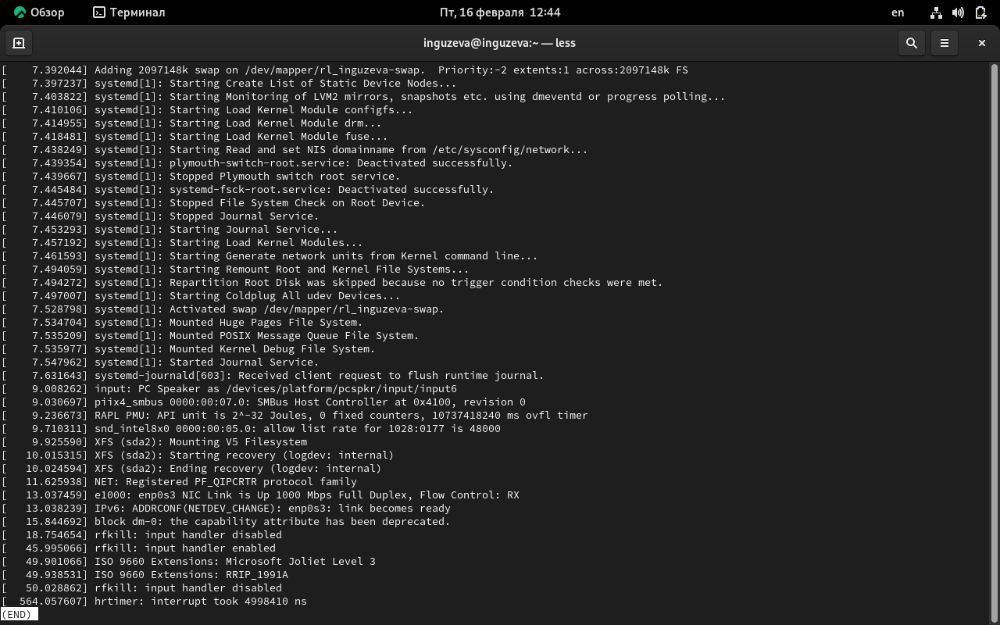
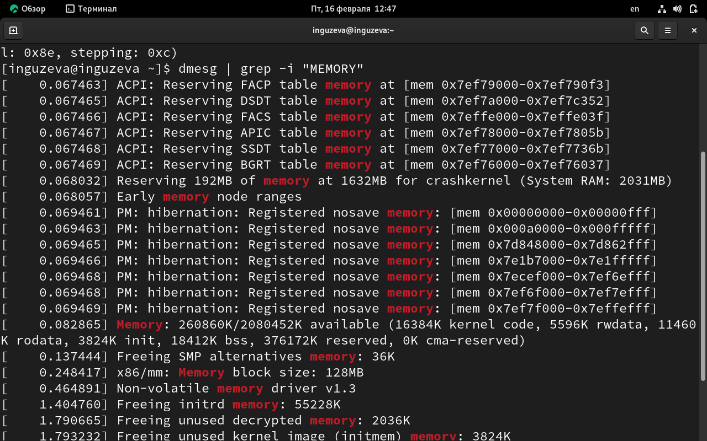
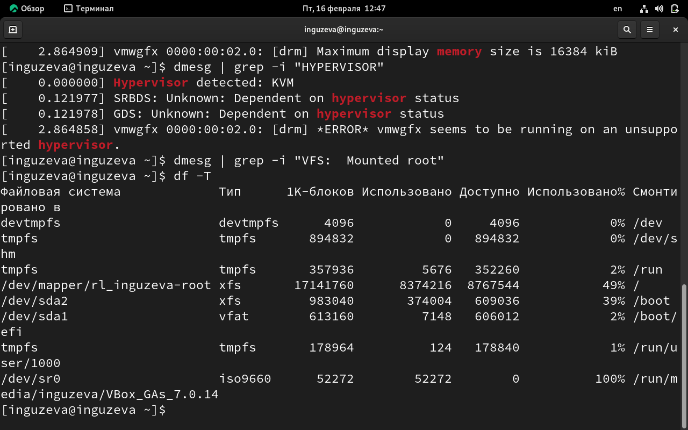
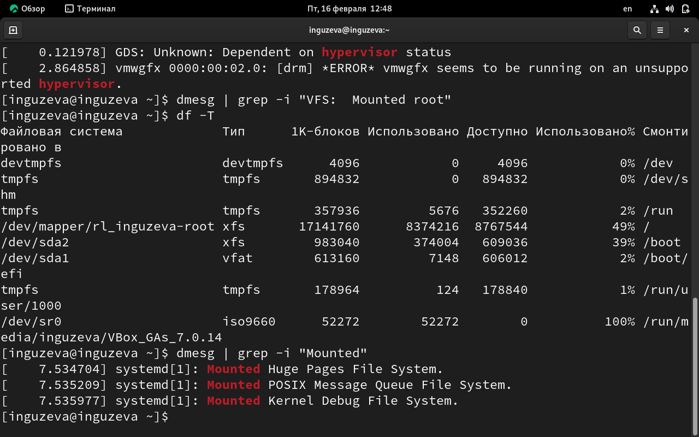

---
## Front matter
lang: ru-RU
title: Лабораторная работа №1
subtitle: Информационная безопасность
author:
  - Гузева Ирина Николаевна
institute:
  - Российский университет дружбы народов, Москва, Россия
date: 2023

## i18n babel
babel-lang: russian
babel-otherlangs: english

## Formatting pdf
toc: false
toc-title: Содержание
slide_level: 2
aspectratio: 169
section-titles: true
theme: metropolis
header-includes:
 - \metroset{progressbar=frametitle,sectionpage=progressbar,numbering=fraction}
 - '\makeatletter'
 - '\beamer@ignorenonframefalse'
 - '\makeatother'
---

::::::::::::::

## Цель лабораторной работы

- Настроить рабочее пространство для лабораторных работ, приобрести практические навыки
установки операционной системы на виртуальную машину и настройки минимально необходимых для дальнейшей работы сервисов
- Изучить идеологию и применение средств контроля версий, освоить умения по работе с git
- Научиться оформлять отчёты с помощью легковесного языка разметки Markdown

## Теоретическая справка

- **Oracle VM VirtualBox** — мощная и бесплатная виртуализационная платформа, разработанная корпорацией Oracle, которая позволяет пользователям создавать и управлять виртуальными машинами на своих компьютерах

## Теоретическая справка

- **Git** — система управления версиями с распределенной архитектурой. В отличие от некогда популярных систем вроде CVS и Subversion (SVN), где полная история версий проекта доступна лишь в одном месте, в Git каждая рабочая копия кода сама по себе является репозиторием. Это позволяет всем разработчикам хранить историю изменений в полном объеме

## Теоретическая справка

- **Markdown** — облегчённый язык разметки, созданный с целью обозначения форматирования в простом тексте, с максимальным сохранением его читаемости человеком, и пригодный для машинного преобразования в языки для продвинутых публикаций (HTML, Rich Text и других)

# Ход выполнения лабораторной работы

## Создание директории лабораторной работы

- 2023-2024/Информационная безопасность/infosec

## Создание репозитория

- по шаблону, представленному на https://github.com/yamadharma/course-directory-student-template.

## SSH и PGP ключи

- Запрос ключа
- Получение id ключа
- Добавление ключа в свой профиль
- Настройка связи аккаунта со своей виртуальной машиной по ключу

## Клонирование репозитория

- Репозиторий нужно рекурсивно склонировать на свой рабочий компьютер

## Markdown

- Конвертация отчета формата .md в отчет форматы .docx и .pdf при помощи команды make и файла Makefile
- Конвертация презентации формата .md в презентацию формата pdf

## Обновление директории и репозитория

- Создание дополнительных каталогов всех лабораторных работ
- Удаление лишних файлов
- Отправка всех изменений на Git

## Выполнение команды dmesg

##  Вывод информации о ядре и процессоре

## Вывод информации об объеме доступной памяти

## Вывод типа обнаруженного гипервизора

## Вывод типа файловой системы корневого раздела

## Вывод последовательности монтирования файловых систем

# Вывод

## Вывод

- Были настроено рабочее пространство для лабораторных работ, приобретены практические навыки
установки операционной системы на виртуальную машину и настройки минимально необходимых для дальнейшей работы сервисов.
- Были изучены идеология и применение средств контроля версий, освоены умения по работе с git.
- Были приобретены практические навыки оформляения отчётов с помощью легковесного языка разметки Markdown.

# Список литературы. Библиография

[1] Документация по Virtual Box: https://www.virtualbox.org/wiki/Documentation

[2] Документация по Git: https://git-scm.com/book/ru/v2

[3] Документация по Markdown: https://learn.microsoft.com/ru-ru/contribute/markdown-reference
